# Aplicación Desktop Java - Sistema de Reservas de Hotel

Este programa integra funciones gráficas con lógica para la ejecución de un sistema de reservas de hotel aplicando patrones de desarrollo para maximizar la escalabilidad del proyecto.

### 🖥️ Tecnologías Utilizadas:

Java

Eclipse

Biblioteca JCalendar

MySql

Plugin WindowBuilder

***

### ⚠️ Importante! ⚠️

Compatible con Java versión 8 o superior.

#### Requiere la importación de las siguientes librerías externas:

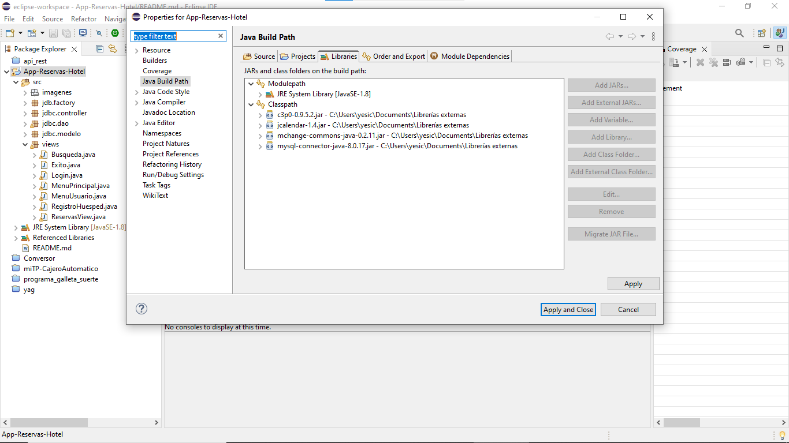

#### Requiere la creación previa de una base de datos con dos tablas, la cual debe configurarse dentro del archivo ConnectionFactory.java:

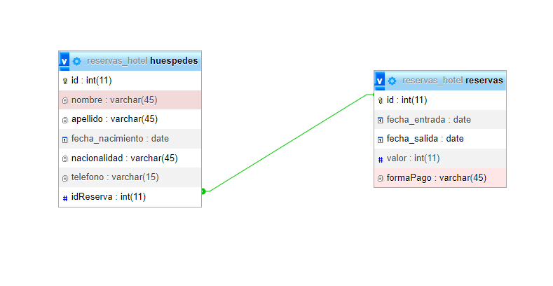

#### 🎨 La interfaz contiene dos métodos importantes:

setResizable(false): determina el tamaño de la ventana, y a través del parámetro false, la pantalla no se puede maximizar.

setLocationRelativeTo(null): determina la ubicación de la ventana, y a través del parámetro null la mantiene centrada en la pantalla.

***

### La ventana con la que se debe iniciar la aplicación es la de Menú Principal (MenuPrincipal.java):

Desde la cual podrá avanzar de forma gráfica hacia la de Login:

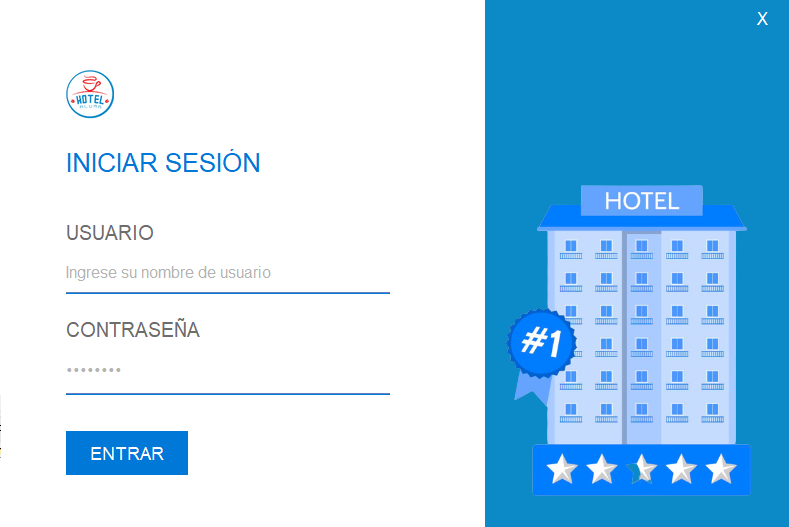

#### Los datos definidos para poder validar el ingreso son:

Usuario= admin

Contraseña= admin

Una vez ingresados los datos de acceso, la aplicación le permitirá optar por crear una reserva o realizar una búsqueda de un registro de reserva o huésped existente.

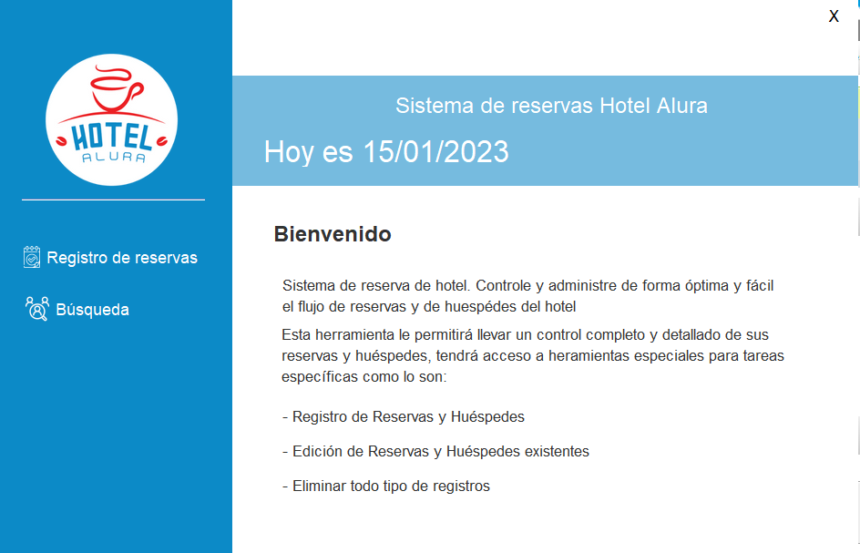

#### Registro de Reserva

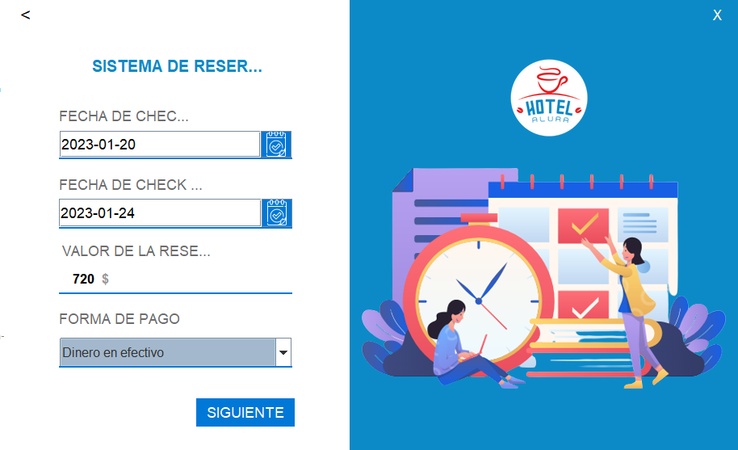 

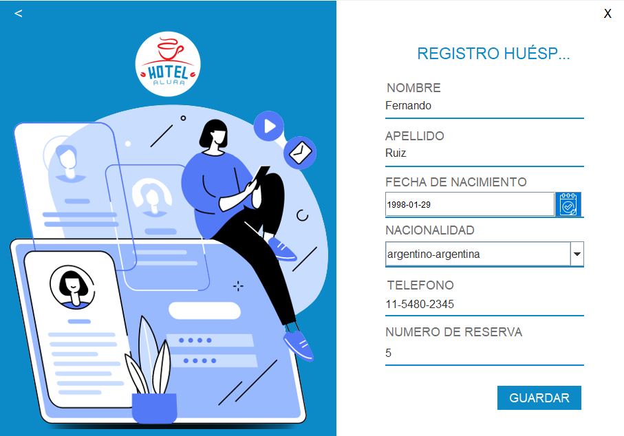

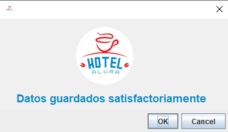

***

Si ingresó en la opción de Búsqueda podrá optar por editar o eliminar el registro seleccionado o bien realizar una búsqueda específica por número de id.

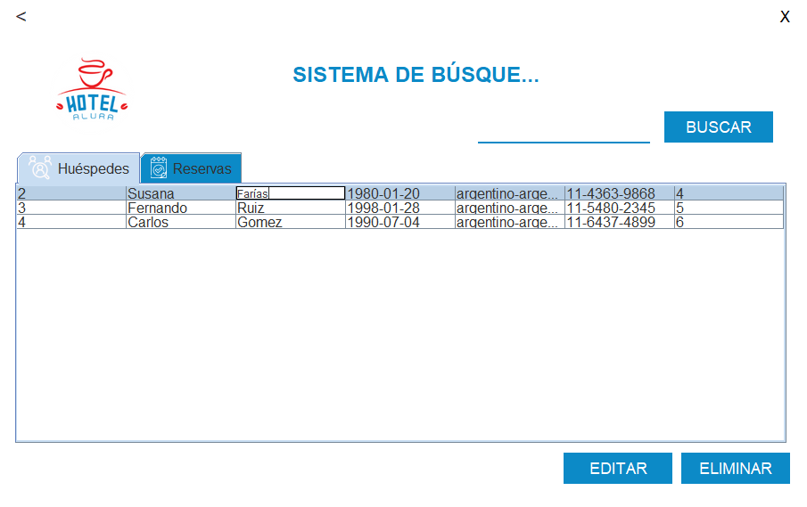

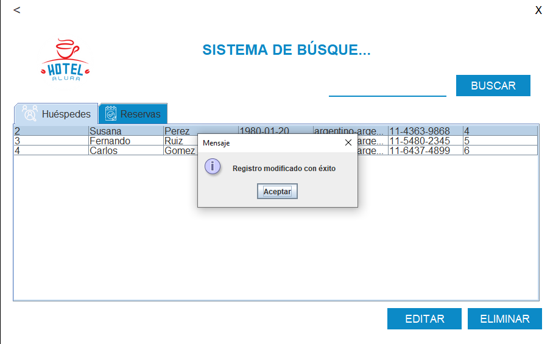

***

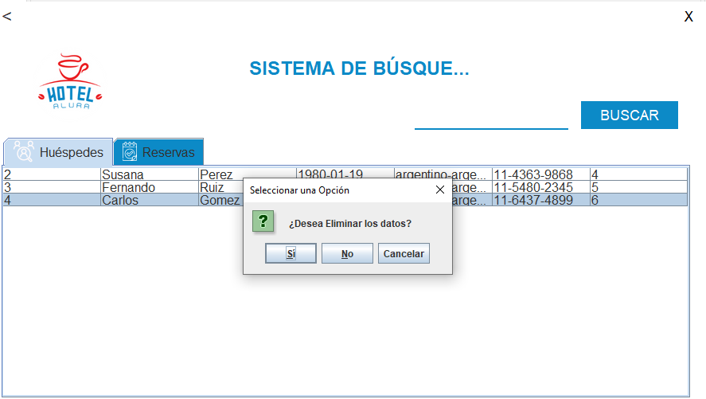

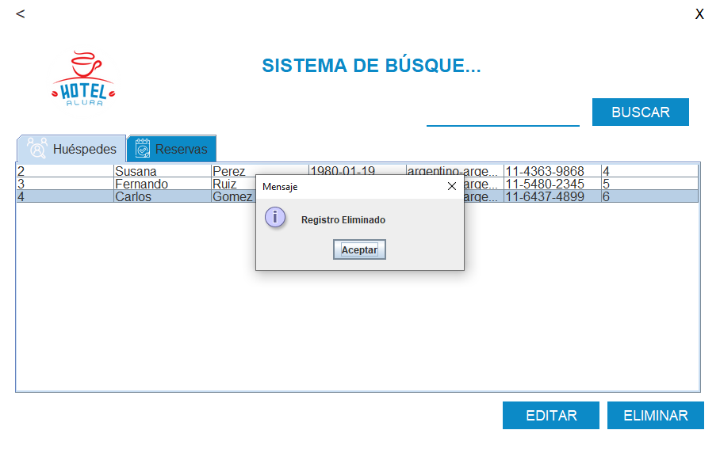

***

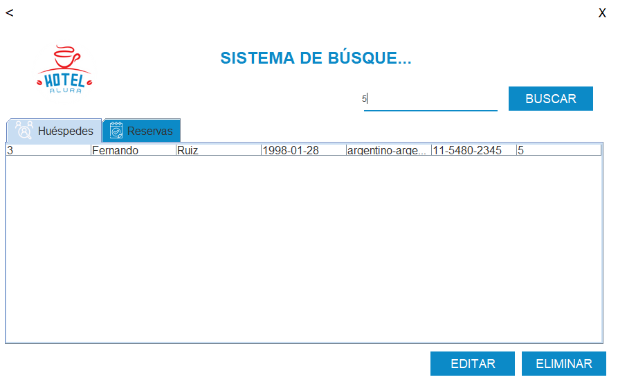

***

Finalmente puede ir hacia atrás o cerrar la aplicación con los íconos disponibilizados en la parte superior de cada ventana.

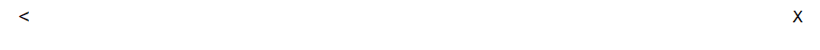